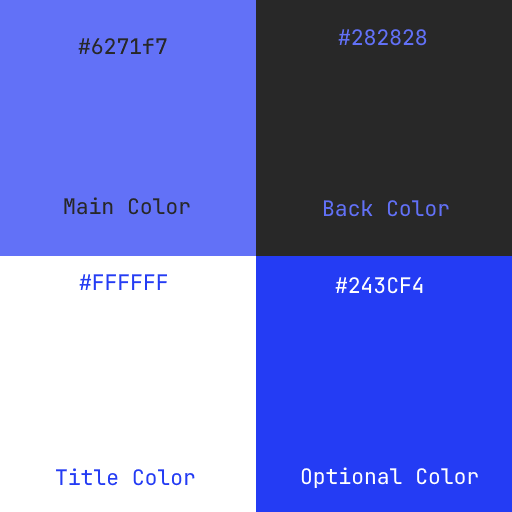

# neo: nikeedev's theme

`neo` is a theme that is proudly been made by [@nikeedev](https://github.com/nikeedev), and before it's creation as a color palette, it was used as the main colours of the nikee.dev website. 

## Here is the palette:

Neo is based of only colours, making it easier to use, but also better to understand the content where the colors are used, making it less stressed than content with a lot of colours, disturbing the person. 

The Main and the Back color, is the main colours, those can be used any way. Either the Main as foreground and Back as background, or opposite they both fit the style. 

The Title Color should always be used only when you want to mark out a text, like a link or a warning messsage. The color will make the user aware while simultaneously keeping the person calm.

The Optional Color should be used to show contrast to something. As the name suggests, use it optionally, or when you want to mark something else out that is not as important as the Title Color.

You can see the Neo Colors in action on https://nikee.dev website, or https://stio.studio (you have to  change the theme manually through the [settings website](https://settings.stio.studio)).

If you want to use the colors, go away! In fact I recommend, as the blue colour is for calming the user while the black gives a more visible content, and of course it gives better contrast than other colours.

*@nikeedev*
